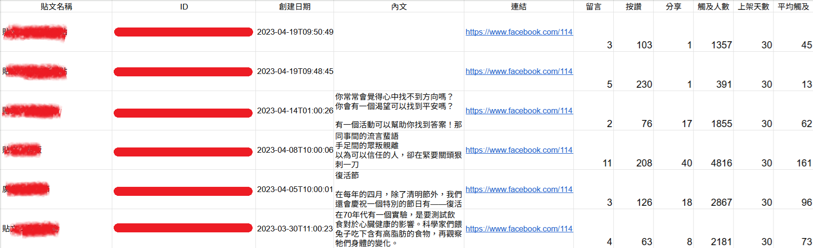

# Facebook 粉專數據分析工具

使用 **Google Apps Script** 串接 Facebook 粉絲專頁 API，  
自動擷取互動數據（按讚、分享、留言數、客群年齡、居住地等），  
並將結果寫入 **Google 試算表**，方便後續數據分析與行銷策略調整。

---

## 功能特色
- 自動擷取粉絲專頁貼文互動數據
- 匯入 Google 試算表，方便整理與分析
- 協助分析貼文類型，找出更受觀眾喜愛的內容
- 節省人工整理時間，提高數據分析效率

---

## 使用技術
- Google Apps Script (JavaScript 語法基礎)
- Facebook Graph API
- Google Sheets API

---

## 範例成果

